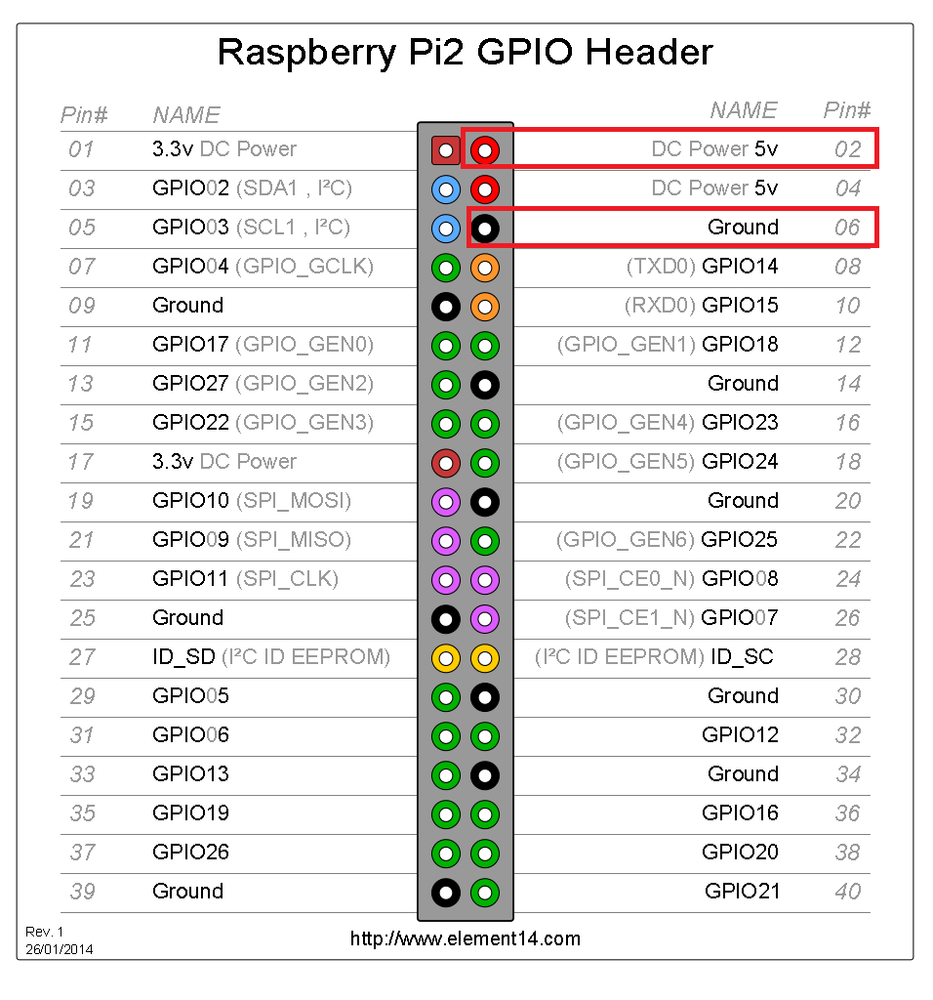

# Wecast
Custom Wecast rk3036 project

## HowTo

#### Tools

Dump the flash:
- Raspberry Pi
- flashrom: https://www.flashrom.org/Flashrom

Get info from dump:
- binwalk: https://github.com/ReFirmLabs/binwalk

Extract file system:
- dd command

Descompress the SquashFS file system:
- unsquashfs

Compress the SquashFS file system:
- mksquashfs

#### Pinout

| RPi pin | SPI |
|:-------:|:---:|
| 25 | 10 |
| 24 | 7 |
| 23 | 16 |
| 21 | 8 |
| 19 | 15 |
| 17 | 2 |

